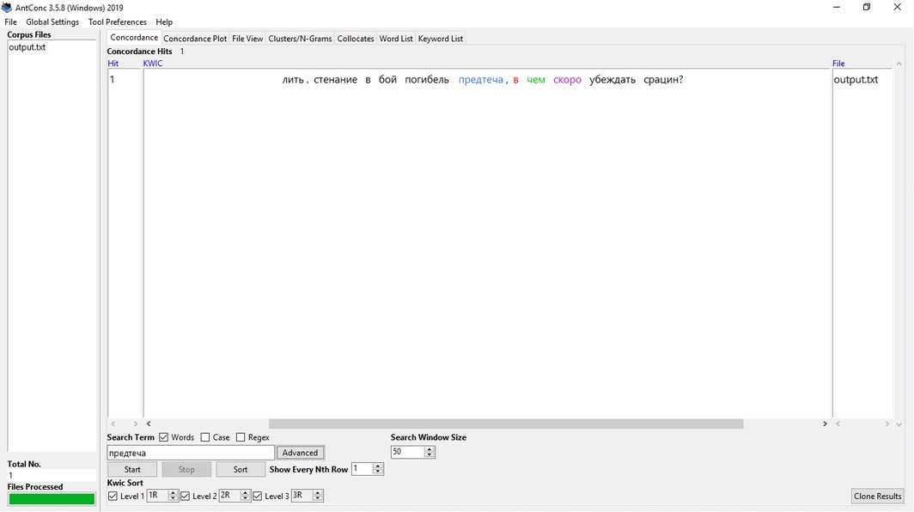

# HW3
Задание 1

Задание 2

IPM "сретенье" ≈ 0,19

IPM "вкруг" ≈ 7,33

IPM "глас" ≈ 20,5

[b]Задание 3[/b]
Исследование корпусов оказалось интересным занятием! Я уже использовала знания, полученные на семинарах по цифровой грамотности, в модульном эссе и своей курсовой работе по стихотворению. При написании модульного эссе на тему "Семантика собственных имен в повести И. С. Тургенева "Первая любовь" я много работала с НКРЯ и получила неожиданные результаты; оказывается, у многих персонажей были литературные прототипы, которых удалось найти при помощи поиска в корпусе имен собственных. В курсовой работе НКРЯ помог найти неочевидные цитатные мостики к другим произведениям, а AntConc выявил определенные черты авторского стиля. GoogleNgrams мне пока не пригодился, но, по крайней мере, работать с ним было интересно, потому что он отражает развитие языка. 
